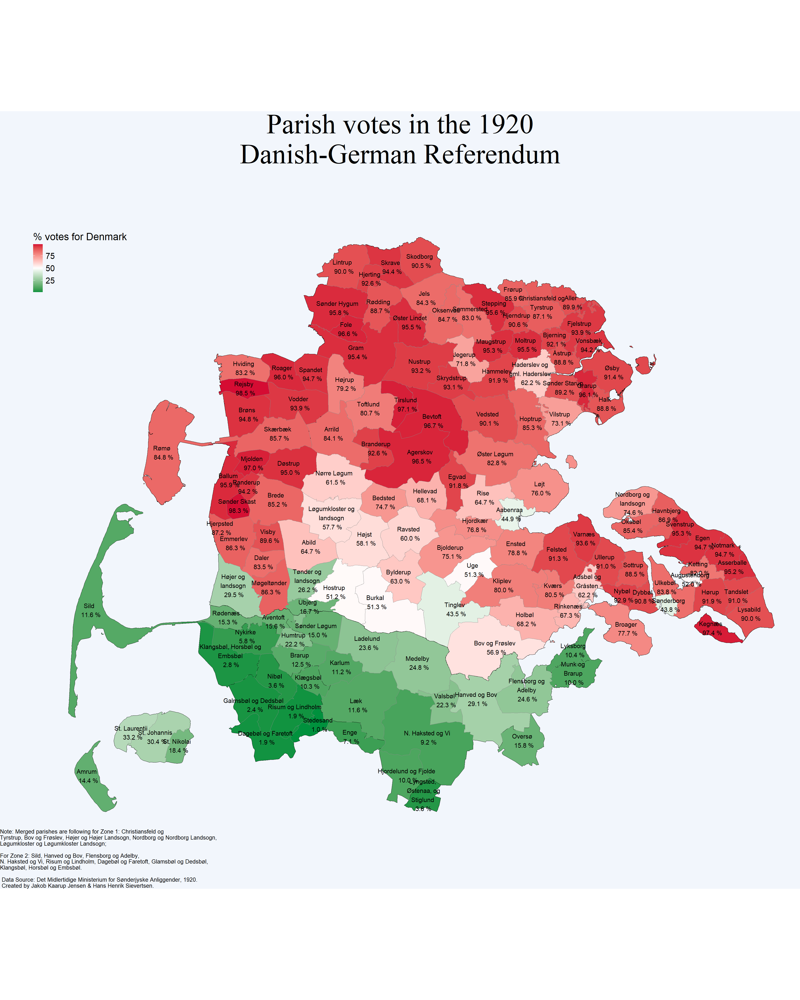

# About
We digitized the tables from the book ["Afstemningen i Sønderjylland (I og II ZONE)"](https://www.kb.dk/e-mat/ww1/114028018322.pdf) (Det Midlertidige Ministerium for Sønderjyske Anliggender, 1920) on the  1920 Danish-German referendum and made it available as csv files in the **data** folder. The **shapefiles** folder contains shapefiles (zipped) here used to create the map.  Everyone is welcome to use the data, but please cite the original source (the aforementioned book). 

We describe the data and provide som illustrations in this note:
Please let us know if you find any mistakes (to: [mail@hhsievertsen.net](mail@hhsievertsen.net)).

Jakob Kaarup Jensen and Hans Henrik Sievertsen 

